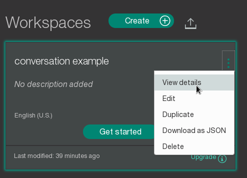
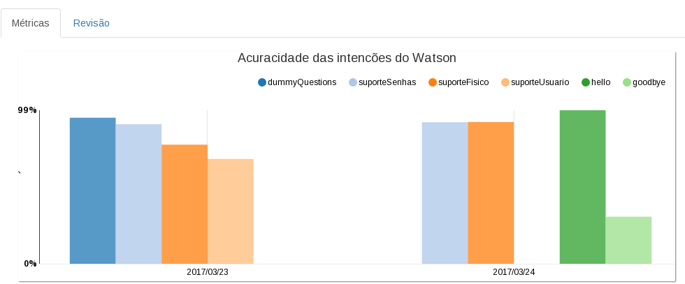
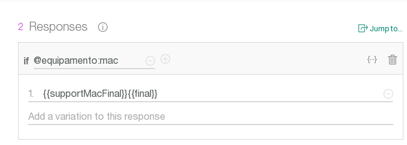
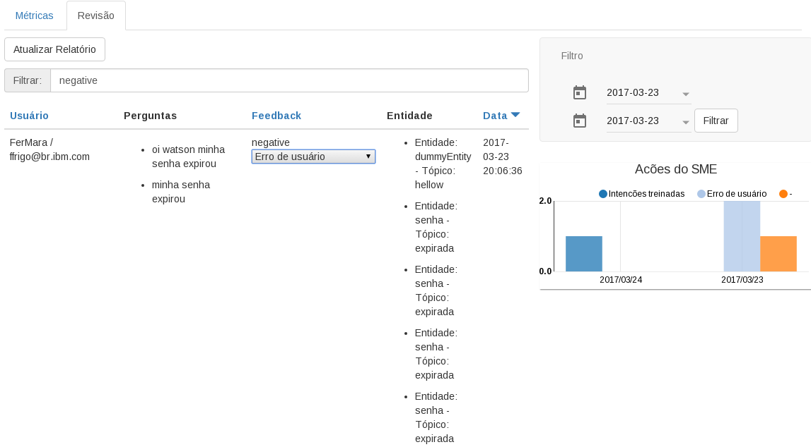

# Watson Cognitive Service Desk - Provider

## Sobre

> CSD Provider é o backend que suporta o [CSD Widget](https://github.com/CIO-Stark/conversation-widget). Ele atua como middleware entre a [API do Watson Conversation](https://www.ibm.com/watson/developercloud/conversation.html) e o conteúdo do Widget.

Basicamente os usuários vão interagir com a [API do Watson Conversation](https://www.ibm.com/watson/developercloud/con
versation.html) e ao final, vão indicar um feedback final quanto à ajuda: Se foi válida ou não.

Esta aplicação consiste em um conjunto básico de reports que vão indicar algumas métricas quanto ao uso do Widget e resultados dos feedbacks, servindo como um ponto de entrada para aplicações que necessitem acompanhar os dados das conversações de usuários. 


## Veja a demo online

> Para acessar uma demonstração online desta aplicação, acesse: [CSD Provider](https://stark-dev-uradigital.mybluemix.net/) 

Para utilizar a demo coloque o usuario e senha: 
Usuario: admin
Senha: 123


> Para acessar o __CSD Widget__ acesse [CSD Widget](https://stark-dev-uradigital.mybluemix.net/widget2) ou [CSD Widget](https://stark-dev-uradigital.mybluemix.net/widget)  
Entre com um nome e email qualquer

## Setup

> O setup do CSD Provider consiste na conexão de sua aplicação com as APIs corretas do Watson no Bluemix.


### 1 - Configure sua conta no Bluemix
> Acesse o [Bluemix](https://console.ng.bluemix.net) e crie sua conta.
Uma vez autenticado e no dashboard inicial, crie os seguintes serviços:
> * App: Node JS SDK - Para execucão da app do CSD Provider
> * Watson Cloudant - Base de dados noSQL para registro de métricas do chat
> * Watson Conversation - Servico Cognitivo de conversacão do Watson

### 2 - Configuração
> * Faça a conexão de sua aplicação do Bluemix: Node JS APK com um repositório git de preferência e dê um push dos códigos fontes recebidos para a mesma
> * Selecione seu serviço do Watson Conversation. Deverá aparecer uma opção de __Launch Dashboard__
Uma vez no dashboard faça a importação de um [Conversation padrão](json/workspace.json) disponibilizado junto com o CSD Provider e que servirá como guia para criação de fluxo de conversação próprio. 
Você também deve obter o Workstation ID conforme imagem abaixo:




> * Retorne ao dashboard de sua aplicação, selecione a opção __RUNTIME__ e em __Environments Variables__ crie a variável:

| Variável        | Valor|
| --------------- | ------------------ |
|workspace_id  | -valor do Conversation Workspace ID|

> * Acesse seu serviço de Cloudant e crie um database com nome: __hr_feedback__
> * Também garanta que um índice de query esteja criado. Pode-se utilizar o seguinte modelo:

```json
{
  "index": {
    "fields": [
      {
        "feedbackDate": "asc"
      }
    ]
  },
  "type": "json"
}
```

### 3 - Execução

> Agora que fizemos o setup do CSD Provider, é necessário seguir a documentação do [CSD Widget](https://github.com/CIO-Stark/conversation-widget) e indicar o endpoint do CSD Provider na configuração do mesmo:

```js
window.conversationWidget.init({
    "baseURL": {{CSD Provider endpoint}}/askWatson?module=hr_module
```

### 4- Preparação e instruções avançadas

> * A workspace do Watson Conversation deve estar funcionando no fluxo correto de seu serviço de atendimento. 
Para criação de um fluxo básico de conversação e integração com o Watson CSD, execute os seguintes passos:
1- Crie uma Intenção e dê o nome: #Ajuda

2- Inclua diversas frases (pelo menos 5 mas atente-se que quanto mais frases existentes, maior será a acuracidade do Watson) relacionadas à um tópico de ajuda comum

3-  Em Diálogs, crie um Dialogo e indique que a trigger é disparada pela Intent: if #Ajuda

4- Inclua uma resposta padrão para a ajuda. Ex: Como posso te ajudar?

5- Clique no ícone "Continue Conversation" e especialize melhor o tipo de ajuda. Para isso vamos criar uma entidade chamada: __@EntidadeAjuda__ e incluir 2 valores: 
    __Ajuda Genérica__> Como faço, tenho dúvidas, dúvida, estou confuso
    __Ajuda de produto__ > Não sei ligar, não funciona, como ligo, manual de operações
    
6- Com as entidades criadas, volte ao ícone do Dialog "Continue Conversation" e crie um novo Diálogo.  Em trigger coloque: __if @EntidadeAjuda__ e adcione uma resposta com __if @EntidadeAjuda:Ajuda Genérica__. Coloque algumas respostas para esta entidade.
Adcione uma segunda resposta e na condição, coloque __if @EntidadeAjuda:Ajuda de produto__

Com isso o Watson deverá encaminhar perguntas de ajuda para o Diálogo correto e inclusive identificando qual a entidade relacionada à pergunta.
Cada Intent (passo 1 acima) será identificada pelo Watson quando a API responder uma pergunta. Ela virá junto de uma acuracidade 0% a 100% de certeza quanto à relação do que foi perguntado e o que o Watson julgou ser o uso da Intent(Intenção) no contexto.

Estas intenções serão utilizadas no dashboard do CSD no que diz respeito à acuracidade:



>* Algumas tags podem ser incluídas no corpo das respostas da API do Watson e serem assim substituídas na aplicação em alguns casos específicos. Por exemplo, quando precisar forçar especificamente o fim do fluxo no Widget e assim oferecer a opção do usuário postar um feedback ou então se precisar incluir tags HTML avançadas que ficariam difíceis de serem editadas na UI do Watson.

As tags principais são:


| Tag        | Descrição|
| --------------- | ------------------ |
|{{varName}}   | -Substitui o nome do usuário logado no widget |  
|{{final}}  | Indica ao widget que é fim de fluxo, deve-se apresentar as opções de feedback se este estiver habilitado|
Exemplo da tag {{final}} sendo utilizada no Watson Conversation:



Outra forma de substituição pode ser realizada através do uso das classes [elements.js](/server/helpers/elements.js) e [ResponseModifier.js](/server/helpers/ResponseModifier.js)
Estas servem como exemplo simples de funcionalidades que podemos agregar ao retorno do Watson Conversation, substituindo determinadas tags por conteúdos mais complexos (html por exemplo) e dessa forma prover menus e funcionalidades mais fáceis de serem mantidas externamente do que como conteúdo das respostas do próprio Watson.


>* Na tela do SME Board é possível indicar uma ação para qualquer feedback que o status foi __Negativo__ . No dashboard, acessando o menu Revisão, procure pelo histórico de feedback e nos negativos selecione algumas das opções existentes para indicar que determinado feedback negativo sofreu alguma ação de ajuste do SME:




---

